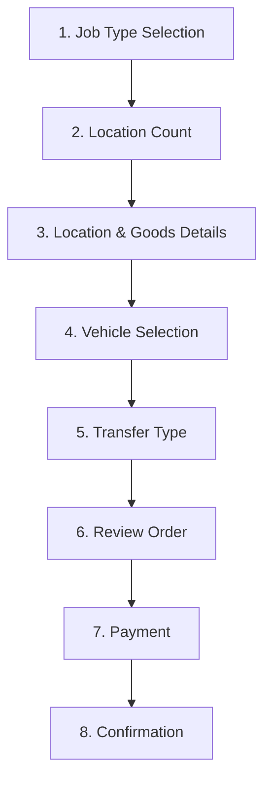

# Shipper Application - Comprehensive Documentation

**Generated:** 2025-07-16  
**Application:** Phoenix Prime Shipper - React Web Application  

## Table of Contents
1. [Application Overview](#application-overview)
2. [Architecture & Technology Stack](#architecture--technology-stack)
3. [Application Flow & User Journey](#application-flow--user-journey)
4. [Component Structure & Analysis](#component-structure--analysis)
5. [State Management & Data Flow](#state-management--data-flow)
6. [UI/UX Patterns & Styling](#uiux-patterns--styling)
7. [Development Setup & Scripts](#development-setup--scripts)
8. [Testing Strategy](#testing-strategy)
9. [File Structure](#file-structure)

---

## Application Overview

Phoenix Prime Shipper is a comprehensive React-based web application for managing shipping and logistics operations. The app provides a multi-step booking flow that guides users through creating shipping orders with various complexity levels, from single pickup/delivery to multi-location shipments.

### Key Features
- **Multi-step booking process** with 8 distinct steps
- **Three job types**: Single pickup/drop, Multi-pickup, Multi-drop
- **Address book management** with add/select functionality
- **Goods categorization** with packaging types and restrictions
- **Vehicle selection** based on shipment requirements
- **Transfer type options** (Express, Standard, Economy)
- **Review and payment processing**
- **Booking confirmation** with tracking details

---

## Architecture & Technology Stack

### Core Technologies
```json
{
  "framework": "React 19.1.0",
  "styling": "Tailwind CSS 3.4.17",
  "build_tool": "Create React App 5.0.1",
  "testing": "Jest + React Testing Library",
  "performance": "Web Vitals",
  "css_processing": "PostCSS + Autoprefixer"
}
```

### Application Architecture
The application follows a **Single Page Application (SPA)** pattern with:
- **Component-based architecture** with functional components
- **React Hooks** for state management (useState, useEffect)
- **Prop drilling** for state passing between components
- **Conditional rendering** for multi-step flow navigation
- **Mobile-first responsive design** with max-width container

---

## Application Flow & User Journey

### 8-Step Booking Process



#### Step Details:

1. **Job Type Selection** (`JobTypeScreen`)
   - Single pickup/drop
   - Multi-pickup (multiple pickups → 1 delivery)
   - Multi-drop (1 pickup → multiple deliveries)

2. **Location Count** (`LocationCountScreen`)
   - Only for multi-pickup/multi-drop jobs
   - Validates against packaging type limitations
   - Max 10 locations for pallets/bags, 30 for boxes/loose items

3. **Location & Goods Details** (`LocationDetailsScreen` + `GoodsDetailsScreen`)
   - Customer information (name, mobile for pickup)
   - Address selection/creation via address book
   - Date/time scheduling with trading hours
   - Goods categorization and packaging details

4. **Vehicle Selection** (`VehicleSelectionScreen`)
   - Vehicle type selection based on goods requirements
   - Driver preferences and restrictions

5. **Transfer Type** (`TransferTypeScreen`)
   - Express, Standard, or Economy options

6. **Review** (`ReviewScreen`)
   - Complete order summary
   - Edit capabilities for all sections

7. **Payment** (`PaymentScreen`)
   - Payment method selection and processing

8. **Confirmation** (`BookingConfirmedScreen`)
   - Booking reference and tracking details

---

## Component Structure & Analysis

### Core Application Component
```javascript
// App.js (3,439 lines) - Main application container
const App = () => {
  // State management for multi-step flow
  const [currentStep, setCurrentStep] = useState('jobType');
  const [jobData, setJobData] = useState({});
  
  // Step navigation logic
  const renderCurrentScreen = () => { /* ... */ };
  
  return (
    <div className="max-w-md mx-auto bg-white min-h-screen">
      {renderCurrentScreen()}
    </div>
  );
};
```

### Reusable UI Components

#### 1. **ProgressBar Component**
```javascript
const ProgressBar = ({ currentStep, totalSteps, stepNames }) => {
  const progress = (currentStep / totalSteps) * 100;
  // Visual progress indicator with gradient styling
};
```

#### 2. **Header Component**
```javascript
const Header = ({ title, onBack, showBack = true }) => {
  // Consistent header with back navigation
  // Gradient background: blue-500 → blue-600 → purple-600
};
```

#### 3. **AddressBookModal Component**
```javascript
const AddressBookModal = ({ isOpen, onClose, addresses, onSelect, onAdd }) => {
  // Modal for address management
  // Add new addresses or select from existing
  // Form validation for required fields
};
```

### Screen Components (8 total)

Each screen component follows consistent patterns:
- **Props interface**: `{ onNext, onBack, initialData, jobData }`
- **Form state management**: Local useState for form data
- **Validation logic**: Required field checking before navigation
- **Responsive design**: Mobile-first with Tailwind classes
- **Consistent styling**: Gradient headers, white cards, blue accent colors

---

## State Management & Data Flow

### State Architecture
```javascript
// Main App State
const [currentStep, setCurrentStep] = useState('jobType');
const [jobData, setJobData] = useState({
  jobType: null,
  locationCount: null,
  pickupLocations: [],
  deliveryLocations: [],
  pickupGoods: [],
  deliveryGoods: [],
  vehicle: null,
  transferType: null,
  // ... other job-related data
});
```

### Data Flow Pattern
1. **Downward Props**: Parent App passes data to screen components
2. **Upward Callbacks**: Screen components call onNext/onBack with form data
3. **State Accumulation**: Each step adds to the central jobData object
4. **Navigation Logic**: App component manages step transitions

### Local State Management
Each screen maintains its own form state:
```javascript
const [formData, setFormData] = useState({
  customerName: initialData.customerName || '',
  address: initialData.address || null,
  // ... other form fields
});
```

---

## UI/UX Patterns & Styling

### Design System

#### Color Palette
```css
/* Primary Gradients */
.gradient-primary {
  background: linear-gradient(to right, #3b82f6, #2563eb, #9333ea);
}

/* Neutral Colors */
.text-slate-600  /* Secondary text */
.text-slate-800  /* Primary text */
.bg-slate-50     /* Background */
.border-slate-200 /* Borders */
```

#### Typography Scale
- **Headings**: `text-lg font-semibold` (18px, 600 weight)
- **Body text**: `text-sm` (14px)
- **Labels**: `text-sm font-medium` (14px, 500 weight)
- **Captions**: `text-xs` (12px)

#### Component Patterns

##### Card Layout
```javascript
<div className="bg-white rounded-xl p-6 border border-slate-200 shadow-sm">
  {/* Card content */}
</div>
```

##### Button Styles
```javascript
// Primary Button
<button className="w-full bg-gradient-to-r from-blue-500 via-blue-600 to-purple-600 text-white p-4 rounded-lg font-medium hover:from-blue-600 hover:via-blue-700 hover:to-purple-700 transition-all transform hover:scale-105 shadow-lg">

// Secondary Button
<button className="w-full bg-white rounded-xl p-6 border border-slate-200 hover:border-blue-300 hover:shadow-md transition-all duration-200">
```

##### Form Input Pattern
```javascript
<input className="w-full p-4 border border-slate-300 rounded-xl focus:border-blue-500 focus:ring-2 focus:ring-blue-100 focus:outline-none transition-all bg-slate-50 focus:bg-white" />
```

### Responsive Design
- **Mobile-first approach**: All components designed for mobile screens
- **Container width**: `max-w-md mx-auto` (448px max width, centered)
- **Touch-friendly**: Large button areas (p-4, p-6)
- **Consistent spacing**: Space-y-4, space-y-6 for vertical rhythm

---

## Development Setup & Scripts

### Package.json Scripts
```json
{
  "scripts": {
    "start": "react-scripts start",      // Development server (port 3000)
    "build": "react-scripts build",      // Production build
    "test": "react-scripts test",        // Test runner (watch mode)
    "eject": "react-scripts eject"       // CRA eject (one-way)
  }
}
```

### Development Workflow
1. **Start development**: `npm start` → http://localhost:3000
2. **Run tests**: `npm test` → Interactive test watcher
3. **Build production**: `npm run build` → Optimized build in `build/` folder

### Configuration Files
- **Tailwind Config**: `tailwind.config.js` - CSS utility configuration
- **PostCSS Config**: `postcss.config.js` - CSS processing pipeline
- **Package Config**: `package.json` - Dependencies and scripts

---

## Testing Strategy

### Current Test Setup
```javascript
// src/App.test.js
import { render, screen } from '@testing-library/react';
import App from './App';

test('renders learn react link', () => {
  render(<App />);
  const linkElement = screen.getByText(/learn react/i);
  expect(linkElement).toBeInTheDocument();
});
```

### Testing Infrastructure
- **Framework**: Jest (included with CRA)
- **React Testing**: React Testing Library 16.3.0
- **DOM Assertions**: @testing-library/jest-dom 6.6.3
- **User Interactions**: @testing-library/user-event 13.5.0
- **Test Setup**: `src/setupTests.js` imports jest-dom matchers

### Performance Monitoring
```javascript
// src/reportWebVitals.js
const reportWebVitals = onPerfEntry => {
  if (onPerfEntry && onPerfEntry instanceof Function) {
    import('web-vitals').then(({ getCLS, getFID, getFCP, getLCP, getTTFB }) => {
      // Web Vitals metrics collection
    });
  }
};
```

---

## File Structure

```
shipper/
├── public/
│   ├── index.html          # HTML template
│   ├── manifest.json       # PWA manifest
│   ├── favicon.ico         # Site icon
│   └── logo*.png          # App icons
├── src/
│   ├── App.js             # Main application (3,439 lines)
│   ├── App.css            # Component styles (basic CRA styles)
│   ├── App.test.js        # App component tests
│   ├── index.js           # React app entry point
│   ├── index.css          # Global styles + Tailwind imports
│   ├── reportWebVitals.js # Performance monitoring
│   └── setupTests.js      # Test configuration
├── package.json           # Dependencies and scripts
├── tailwind.config.js     # Tailwind CSS configuration
├── postcss.config.js      # PostCSS configuration
├── CLAUDE.md             # Claude Code guidance
└── README.md             # Create React App documentation
```

### Key Files Analysis

#### **src/App.js** (3,439 lines)
- **Lines 1-100**: Imports, mock data, ProgressBar, Header, JobTypeScreen
- **Lines 101-350**: LocationCountScreen, AddressBookModal
- **Lines 351-1300**: LocationDetailsScreen with form handling
- **Lines 1301-1800**: GoodsDetailsScreen with packaging logic
- **Lines 1801-2120**: VehicleSelectionScreen
- **Lines 2121-2400**: TransferTypeScreen, ReviewScreen
- **Lines 2401-2600**: PaymentScreen, BookingConfirmedScreen
- **Lines 2601-3439**: Main App component with navigation logic

#### **src/index.css** (18 lines)
```css
@tailwind base;      /* Tailwind reset styles */
@tailwind components; /* Tailwind component classes */
@tailwind utilities;  /* Tailwind utility classes */

body {
  font-family: -apple-system, BlinkMacSystemFont, /* ... */;
  /* Modern system font stack */
}
```

---

## Development Guidelines

### Code Patterns to Follow

1. **Component Structure**:
   ```javascript
   const ComponentName = ({ prop1, prop2, onAction }) => {
     const [localState, setLocalState] = useState(defaultValue);
     
     const handleAction = () => {
       // validation logic
       if (valid) onAction(data);
     };
     
     return (/* JSX */);
   };
   ```

2. **Form Handling**:
   - Use controlled components with useState
   - Validate required fields before onNext callback
   - Reset form state when component props change

3. **Styling Conventions**:
   - Use Tailwind utility classes exclusively
   - Follow mobile-first responsive design
   - Maintain consistent spacing with space-y-* classes
   - Use gradient backgrounds for primary elements

4. **Navigation Pattern**:
   - Pass onNext/onBack callbacks from parent
   - Accumulate form data in main App state
   - Use string-based step navigation

### Adding New Features

1. **New Screen Component**: Follow existing screen patterns
2. **New Form Fields**: Add to form state and validation logic
3. **New Styling**: Use existing Tailwind classes and color scheme
4. **Testing**: Add React Testing Library tests for user interactions

This documentation provides a comprehensive understanding of the Shipper application architecture, enabling developers to effectively work with and extend the codebase.